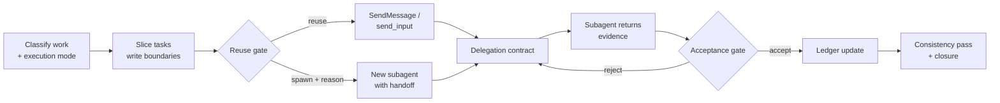

<h1 align="center">Subagent Orchestration</h1>

<p align="center">
  A main-controller + subagent workflow skill for long-running agent work.<br/>
  Plan, delegate, verify evidence, hand off, and close — without losing the thread.
</p>

<p align="center">
  <a href="README.zh-CN.md">中文说明</a>
  ·
  <a href="claude/README.md">Claude Code guide</a>
  ·
  <a href="codex/README.md">Codex guide</a>
</p>

<p align="center">
  
  
  
  
</p>

## Why This Exists

Coding agents are good at single tasks and bad at long ones. Once work spans several hours, several subagents, and several artifacts, the same failures show up every time:

- a subagent reports success, and the controller accepts it without ever inspecting the evidence;
- the controller is asked to review, then quietly starts editing code itself;
- every follow-up question spawns a fresh subagent that starts cold, re-deriving what the last one already knew;
- context compacts mid-task and no handoff was ever written;
- two subagents edit the same file, or drive the same browser session, and overwrite each other;
- the final report says 12 test cases passed, the coverage matrix says 11, and the defect ledger lists a bug that appears in neither.

None of these are model-capability problems. They are missing-contract problems.

Subagent Orchestration is a skill that makes the contract explicit. It gives the main controller a fixed set of questions to answer before any work is delegated:

```text
Who owns this decision — the controller or the subagent?
What exactly is this subagent allowed to read, write, click, or run?
What evidence would prove the work is actually done?
Should I reuse an existing subagent, or is a new one justified?
What happens to this task if context runs out right now?
Do the final artifacts still agree with each other?
```

## What You Get

- **Role contract** — the controller owns planning, acceptance, permissions, and the final answer; subagents own their assigned scope and nothing else.
- **Five execution modes** — `review-only`, `plan-handoff`, `delegated-testing`, `delegated-implementation`, `controller-implementation`, with explicit rules for when a mode may be escalated and what phrasing counts as authorization.
- **Acceptance gates** — concrete reject conditions, so `READY_FOR_ACCEPTANCE` means "inspect my evidence", never "I am done".
- **Reuse gate** — reuse an existing subagent by default; spawning a new one requires a recorded reason, because a new subagent starts without the last one's context.
- **Tool policy enforcement** — when a task requires a specific tool, proof of that tool's use becomes a hard acceptance gate, and fallback artifacts must be labeled as fallback.
- **Templates** — a delegation contract and a handoff document, both ready to paste.
- **Parallelism and consistency rules** — when tasks may run concurrently, and a final pass that checks counts, IDs, statuses, and withdrawn decisions across every artifact.

Both packages are self-contained, make no network calls, and collect no telemetry. The Claude Code package is instruction-led and includes a reference for an optional independent agent hook; the Codex package also includes deterministic local command hooks, their verifier, schema, and tests. Deterministic Codex hooks require a Python 3 runtime but no third-party Python packages.

## Install

Works on **Claude Code** and **Codex**. Pick your platform.

### Claude Code

```bash
git clone https://github.com/juew/subagent-orchestration.git
cp -R subagent-orchestration/claude/skills/subagent-orchestration ~/.claude/skills/
```

Restart Claude Code, then invoke it with `/subagent-orchestration`, or let Claude load it automatically when a task matches. The `claude/` directory is also a valid plugin root if you distribute it through a marketplace.

Copying only the skill is instruction-only. For independent verification, use the Claude reference at `claude/skills/subagent-orchestration/references/evidence-check.md` as an `agent` hook on `Stop` or `SubagentStop` in project `.claude/settings.json`; the host hook, rather than the controller, then triggers the check.

### Codex

```bash
git clone https://github.com/juew/subagent-orchestration.git
cp -R subagent-orchestration/codex/skills/subagent-orchestration ~/.codex/skills/
```

That copy is instruction-only. Deterministic Codex hooks require a Python 3 runtime but no third-party Python packages. For deterministic enforcement, install the complete `codex/` plugin through a configured Codex marketplace. Then open Codex `/hooks`, review `hooks/hooks.json` and `scripts/verify_ledger.py` for this plugin, and trust/enable the hooks there. Restart or refresh Codex to use the skill; deterministic hooks run only after the complete plugin is installed and enabled.

## How It Works

The controller never executes and accepts in the same breath. Every delegated task passes through a gate before it can be depended on.



The core rule is that a subagent's claim and a subagent's evidence are different things. The controller independently verifies before marking work complete or letting downstream tasks depend on it.

## Execution Modes

The most common failure this skill prevents is an agent asked to *review* that ends up *rewriting*. Mode is decided before delegation, not during it.

| Mode | Controller does | Controller must not |
|---|---|---|
| `review-only` | Inspect, coordinate, report | Edit business code, commit, push, deploy |
| `plan-handoff` | Turn findings into a plan, ledger, and prompts | Implement the plan |
| `delegated-testing` | Own the test plan, evidence contract, verdict | Drive the UI itself, beyond preflight or reproduction |
| `delegated-implementation` | Delegate, review evidence, resolve conflicts, verify | Edit business code directly |
| `controller-implementation` | Edit files directly | Assume this mode without explicit authorization |

Short follow-ups like "go ahead" or "continue" never escalate a mode. Authorization has to be unambiguous.

## When Not To Use It

This is a project-manager mode, and it costs coordination overhead. Do not make it the default entry point.

```text
Does the task need multiple executors, multiple artifacts,
cross-context continuation, independent acceptance,
or multi-evidence test regression?

Yes -> subagent-orchestration
No  -> just do the work, or use the relevant domain skill
```

Forcing it onto a small task buys you paperwork and nothing else.

## Repository Layout

```text
claude/                       Claude Code version
  .claude-plugin/plugin.json
  skills/subagent-orchestration/
    SKILL.md
    references/               delegation, handoff, ledger schema, evidence-check hook reference
codex/                        Codex version
  .codex-plugin/plugin.json
  hooks/hooks.json
  scripts/verify_ledger.py
  schemas/ledger.schema.json
  skills/subagent-orchestration/
    SKILL.md
    agents/openai.yaml
    references/
  tests/test_verify_ledger.py
```

Both versions share the same orchestration semantics — role contract, execution modes, acceptance gates, reuse gate, a structured ledger, and handoff rules. They differ in platform primitives and verification: Claude Code delegates through the `Agent` tool, reuses through `SendMessage`, isolates writes with `isolation: "worktree"`, and can register the evidence-check reference as an agent hook; Codex uses `spawn_agent`, `send_input`, `wait_agent`, and `close_agent`, with deterministic command hooks that read the structured ledger and evidence files. Each tree is self-contained, so a Claude Code session never reads Codex tool names and vice versa.

## Who Should Star This

Star this repo if you are:

- running multi-hour agent tasks that need to survive context compaction;
- tired of agents reporting success without evidence;
- building acceptance or regression testing workflows with UI, API, and DB evidence;
- maintaining a team skill library and want a reusable delegation contract;
- designing agent workflows where the reviewer must not become the implementer.

## Roadmap

- A worked example run: coverage matrix, evidence paths, and defect ledger from a real regression pass.
- Guidance for nested subagents (subagents that delegate further).
- Optional evaluation cases for acceptance-gate behavior.

## Documentation

- [Chinese README](README.zh-CN.md)
- [Claude Code guide](claude/README.md)
- [Codex guide](codex/README.md)
- [Delegation contract template](claude/skills/subagent-orchestration/references/delegation-contract.md)
- [Handoff template](claude/skills/subagent-orchestration/references/handoff-template.md)
- [Structured ledger schema](claude/skills/subagent-orchestration/references/ledger-schema.md)
- [Claude evidence-check hook reference](claude/skills/subagent-orchestration/references/evidence-check.md)
- [Codex hook and evidence contract](codex/skills/subagent-orchestration/references/hook-evidence-contract.md)

## License

MIT
