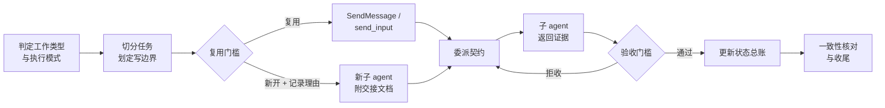

<h1 align="center">Subagent Orchestration</h1>

<p align="center">
  面向长流程 agent 工作的「主控 + 子 agent」编排 skill。<br/>
  规划、分派、验收证据、上下文交接、收尾闭环，全程不丢线索。
</p>

<p align="center">
  <a href="README.md">English</a>
  ·
  <a href="claude/README.md">Claude Code 指南</a>
  ·
  <a href="codex/README.md">Codex 指南</a>
</p>

<p align="center">
  
  
  
  
</p>

## 为什么需要它

编程 agent 擅长做单个任务，不擅长做长任务。一旦工作跨越几个小时、几个子 agent、几份产物，同样的问题就会反复出现：

- 子 agent 报告说做完了，主控没看证据就直接采信；
- 主控被要求做评审，做着做着自己开始改代码；
- 每来一个追问就新开一个子 agent，每个都从零开始，把上一个已经查明的东西再查一遍；
- 上下文在任务中途被压缩，而此前从没写过交接文档；
- 两个子 agent 改同一个文件，或者操作同一个浏览器会话，互相覆盖；
- 最终报告说 12 条用例通过，覆盖矩阵写的是 11 条，缺陷台账里还有一个两边都没出现的 bug。

这些都不是模型能力问题，而是契约缺失问题。

`subagent-orchestration` 把这份契约显式化。它给主控一组固定的问题，要求在分派任何工作之前先回答：

```text
这个决定归谁——主控还是子 agent？
这个子 agent 到底允许读、写、点击、运行什么？
什么样的证据才能证明这件事真的做完了？
应该复用已有子 agent，还是确实有理由新开一个？
如果上下文现在就用完，这个任务会怎么样？
最终的几份产物之间还对得上吗？
```

## 你会得到什么

- **角色契约** —— 主控负责规划、验收、权限和最终结论；子 agent 只负责被分配的边界，不多做一分。
- **五种执行模式** —— `review-only`、`plan-handoff`、`delegated-testing`、`delegated-implementation`、`controller-implementation`，并明确规定什么情况下可以升级模式、什么措辞才算授权。
- **验收门槛** —— 给出具体的拒收条件，让 `READY_FOR_ACCEPTANCE` 只意味着「请检查我的证据」，而不是「我做完了」。
- **复用门槛** —— 默认复用已有子 agent；新开必须记录理由，因为新子 agent 不会继承上一个的上下文。
- **工具策略强制** —— 当任务要求使用特定工具时，工具使用证明成为硬性验收门槛，兜底路径产出的产物必须标注为兜底。
- **模板** —— 委派契约和交接文档各一份，可直接套用。
- **并行与一致性规则** —— 什么时候允许并行，以及收尾前对所有产物做计数、ID、状态、已撤销结论的一致性核对。

全部是纯 Markdown。无脚本、无依赖、无网络请求、无遥测。

## 安装

同时支持 **Claude Code** 和 **Codex**，按平台二选一。

### Claude Code

```bash
git clone https://github.com/juew/subagent-orchestration.git
cp -R subagent-orchestration/claude/skills/subagent-orchestration ~/.claude/skills/
```

重启 Claude Code 后，用 `/subagent-orchestration` 调用，或由 Claude 在任务匹配时自动加载。`claude/` 目录本身也是一个合法的 plugin root，可用于 marketplace 分发。

### Codex

```bash
git clone https://github.com/juew/subagent-orchestration.git
cp -R subagent-orchestration/codex/skills/subagent-orchestration ~/.codex/skills/
```

重启或刷新 Codex 后即可使用。

## 工作方式

主控绝不在同一步里既执行又验收。每个被分派的任务，都必须先过门槛，才能被后续任务依赖。



核心原则是：子 agent 的**声明**和子 agent 的**证据**是两回事。主控必须独立核实，才能把工作标记为完成，或允许下游任务依赖它。

## 执行模式

这个 skill 最常防住的一类事故，是「让它评审、它却动手重写」。模式在分派之前就定好，而不是过程中临时决定。

| 模式 | 主控做什么 | 主控不得做什么 |
|---|---|---|
| `review-only` | 检查、协调、报告 | 改业务代码、提交、推送、部署 |
| `plan-handoff` | 把结论转成计划、总账和提示词 | 亲自实施该计划 |
| `delegated-testing` | 掌握测试计划、证据契约、最终结论 | 超出预检或复现范围亲自操作 UI |
| `delegated-implementation` | 分派、复核证据、裁决冲突、验证 | 直接改业务代码 |
| `controller-implementation` | 直接改文件 | 在未获明确授权时进入此模式 |

「请开始」「继续」「好了」这类简短追问，一律不构成模式升级。授权必须是明确无歧义的。

## 什么时候不要用

这是项目经理模式，本身有协调成本。不要把它当成所有任务的默认入口。

```text
任务是否需要多个执行者、多份产物、跨上下文延续、
独立验收、或多证据测试回归？

是 -> subagent-orchestration
否 -> 直接做，或使用对应的领域 skill
```

小任务强行启用，换来的只有文书工作。

## 仓库结构

```text
claude/                       Claude Code 版本
  .claude-plugin/plugin.json
  skills/subagent-orchestration/
    SKILL.md
    references/               委派契约、交接模板
codex/                        Codex 版本
  .codex-plugin/plugin.json
  skills/subagent-orchestration/
    SKILL.md
    agents/openai.yaml
    references/
```

两个版本的编排语义完全一致——角色契约、执行模式、验收门槛、复用门槛、交接规则都相同，差异只在平台原语：Claude Code 通过 `Agent` 工具分派、通过 `SendMessage` 复用、用 `isolation: "worktree"` 隔离写边界；Codex 使用 `spawn_agent`、`send_input`、`wait_agent`、`close_agent`。两棵树各自自包含，因此 Claude Code 会话不会读到 Codex 的工具名，反之亦然。

## 适合关注本项目的人

如果你符合以下任意一条，欢迎 star：

- 在跑需要熬过上下文压缩的多小时 agent 任务；
- 受够了 agent 不给证据就报成功；
- 在搭建带 UI、API、DB 多重证据的验收或回归测试流程；
- 在维护团队 skill 库，需要一份可复用的委派契约；
- 在设计「评审者不得变成实现者」的 agent 工作流。

## 路线图

- 一个完整的实战示例：真实回归过程产出的覆盖矩阵、证据路径和缺陷台账。
- 一种紧凑的总账格式，能在上下文压缩后无需重读即可恢复。
- 嵌套子 agent（子 agent 再分派）的使用指引。
- 针对验收门槛行为的可选评测用例。

## 文档

- [English README](README.md)
- [Claude Code 指南](claude/README.md)
- [Codex 指南](codex/README.md)
- [委派契约模板](claude/skills/subagent-orchestration/references/delegation-contract.md)
- [交接文档模板](claude/skills/subagent-orchestration/references/handoff-template.md)

## 许可证

MIT
